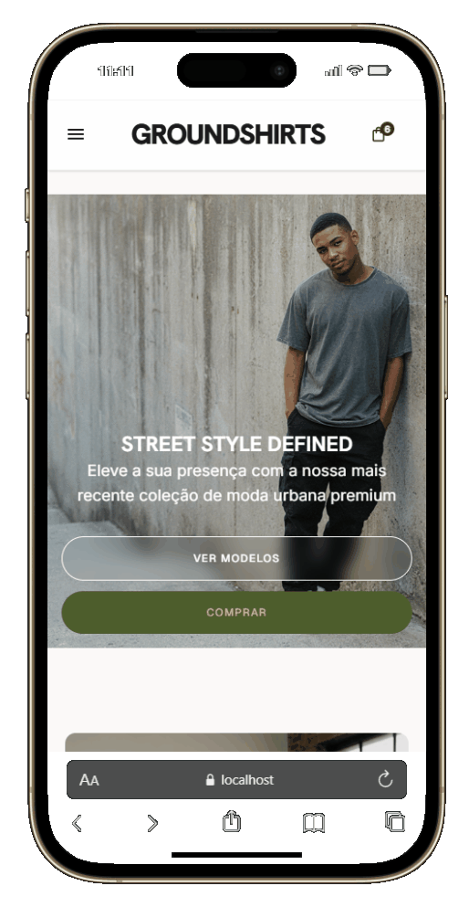

<h1 align="center">
    GroundShirts – E-commerce de Camisetas
</h1>

Aplicação de uma loja virtual de camisetas (GROUNDSHIRTS) desenvolvida com foco em navegação moderna, experiência de compra e organização de componentes reutilizáveis, incluindo catálogo de produtos, filtro por categoria, detalhe de produto, carrinho lateral com persistência de dados e páginas institucionais.

---

## 📄 Descrição

Este projeto consiste em um e-commerce (GROUNDSHIRTS) desenvolvido para praticar conceitos fundamentais de desenvolvimento front-end, como:

- Roteamento baseado em arquivos com TanStack Router
- Gerenciamento de estado global com Context API
- Renderização dinâmica de catálogo e detalhe de produto
- Validação de formulários com React Hook Form + Zod
- Persistência do carrinho no Local Storage
- Consumo de API externa (ViaCEP) para cálculo de frete por região
- Componentes reutilizáveis e responsivos com TailwindCSS

A aplicação permite que o usuário explore produtos, visualize detalhes, calcule frete por CEP e gerencie itens no carrinho de forma simples e intuitiva, mantendo uma interface moderna e responsiva.

---

## 🔗 Preview

<div align="center">

### Mobile 📱

  

  <br>

### Desktop 💻

  
</div>

<br>

🚀 Deploy do projeto:
<a href="https://groundshirts-app.vercel.app/" target="_blank">Deploy</a>

---

## 🚀 Tecnologias Utilizadas

- React 19.2.8
- TypeScript 6.0.2
- TailwindCSS 4.3.3
- TanStack Router 1.170.29
- Context API
- React Hook Form 7.85.0
- Zod 4.4.3
- React Icons 5.7.0
- Vite 8.2.0

---

## ⚙️ Funcionalidades

- Página inicial com banner Hero, seção de categorias e galeria de produtos
- Catálogo dinâmico com 10+ camisetas em diferentes estilos (Oversized, Fleece, Impermeável, etc.)
- Filtro de produtos por categoria via rota dinâmica (Masculino, Feminino, Infantil, Novidades, Estampadas, Básicas, Oversized)
- Página de detalhes do produto com descrição, preço e cor
- Cálculo de frete por CEP com integração da API ViaCEP, com valores de frete por região (Norte, Nordeste, Centro-Oeste, Sudeste, Sul)
- Adição de produtos ao carrinho com validação
- Incremento/decremento de quantidade no carrinho
- Remoção de itens do carrinho
- Carrinho lateral com persistência no Local Storage
- Menu mobile responsivo com navegação intuitiva
- Página institucional "Sobre" com história da marca GROUNDSHIRTS
- Página "Nossas Lojas" com informações de localidades
- Telas de autenticação (Entrar e Cadastro)
- Validação robusto de formulários com Zod e React Hook Form, incluindo validação de email, senha com mínimo de 8 caracteres e confirmação de senha
- Formatação de valores monetários em Real Brasileiro (BRL)

---

## ▶️ Como rodar o projeto localmente

Siga os passos abaixo para rodar o projeto em sua máquina:

```bash
# Clone o repositório
git clone https://github.com/MadeiraVitor/groundshirts-app.git

# Acesse a pasta do projeto
cd groundshirts-app

# Instale as dependências
npm install

# Inicie o servidor de desenvolvimento
npm run dev
```

O projeto estará disponível em:
http://localhost:5173

## 📚 Aprendizados

Durante o desenvolvimento deste projeto, foi possível praticar:

- Estruturação de rotas baseadas em arquivos com TanStack Router e auto code-splitting
- Gerenciamento de estado global com Context API e hooks customizados
- Persistência de dados com Local Storage mantendo sincronização automática
- Criação de componentes reutilizáveis, tipados e escaláveis
- Renderização dinâmica de catálogos e páginas de detalhe de produto
- Validação robusta e assertiva de formulários com Zod e React Hook Form
- Consumo de API externa (ViaCEP) com tratamento de erros e feedback ao usuário
- Implementação de carrinho de compras com operações de CRUD
- Organização de layout responsivo e adaptativo para desktop e mobile
- Estilização moderna com TailwindCSS 4 e sistema de design próprio
- Organização de pastas por feature com interfaces, contextos e componentes bem definidos
- Tratamento de estados assíncronos e erros em requisições HTTP

## 👤 Autor

<div align="center">
    <p>Desenvolvido por <strong>Vitor Madeira</strong></p>
    <a href="https://www.linkedin.com/in/vitor-madeira/" target="_blank"></a>
    <a href = "mailto:vitorsoutom@hotmail.com"></a>
</div>
